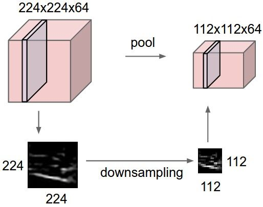
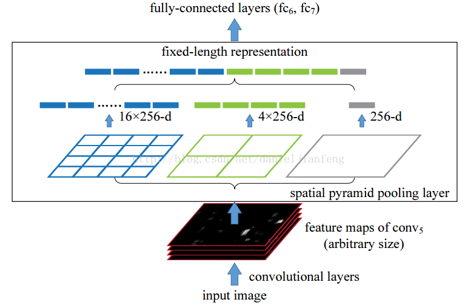

# 随手笔记：池化操作(Pooling Operation)

​     *July 12 2020   Chongqing, China *

## 1 概述

池化操作 (pooling)，又称为下采样(down sampling)，多用在卷积操作之后。卷积操作可以看作对图像特征进行细微的提取，增加了模型的参数，那么池化操作，就是对图像进行粗略或宏观特征的提起，降低模型的参数。从另一个角度看，卷积操作相当于近观，而池化操作相当于远观。常用的池化操作一般分为两类：

1. 平均池化操作（Mean Pooling）
2. 最大化池化操作（Maximal Pooling）
3. 金字塔池化（spatial Pyramid Pooling）

## 2 基本操作

池化操作的特点：

**1 在每一个特征平面上单独操作，也就是说，池化操作不会改变特征数（或者说，不会改变模型的通道数）**

**2 池化操作没有参数，即不会增加模型的参数**

对于1和2池化操作，具体操作见下图：其中，池化的$shape=(2,2) stride = 2$



> 注意：进过池化操作后，特征数64保持不变。

对于金字塔池化，操作见下图：



> 说明：
>
> 1. 输入图像的特征数为256，操作前后保持不变.
> 2. 将原图像进行$1\times1,2\times2,4\times4$划分, 对每一个划分块采用最大化池化，然后将每个结果串联（concate），最后得到$(1+4+16)\times 256$形状的输出。
> 3. 该池化的特点是： 可以获得图像中的多尺度信息，且可以处理任意大小的图像（即**不管输入层的形状，通过设计划分，可以获得任意形状的输出**），从而是CNN模型变得更灵活（flexible）。
>
> 

## 3 tensor flow 的实现


```
import tensorflow as tf
tf.nn.avg_pool(value, ksize, strides, padding, data_format=‘NHWC’, name=None)
```

> 池化操作可以看作是一种特殊的卷积操作，所以两者的参数几乎相同，无非指定输入数据，池化核的参数，步长和padding模。 具体如下：
>
> 1. 第一个参数value：需要池化的输入，一般池化层接在卷积层后面，所以输入通常是feature map，依然是[batch, height, width, channels]这样的shape
> 2. 第二个参数ksize：池化窗口的大小，取一个四维向量，一般是[1, height, width, 1]，因为我们不想在batch和channels上做池化，所以这两个维度设为了1
> 3. 第三个参数strides：和卷积类似，窗口在每一个维度上滑动的步长，一般也是[1, stride,stride, 1]
> 4. 第四个参数padding：和卷积类似，可以取’VALID’ 或者’SAME’。
> 5. data_format : 指定输入数据的格式，即张量`value`的`shape`.NHWC分别表示批量，高，宽和通道数。
> 6. 返回一个Tensor，类型不变，shape仍然是[batch, height, width, channels]这种形式