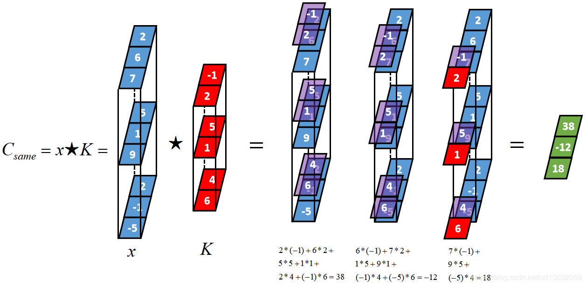

# 一维卷积

## 1 定义

这里的维度，描述了信号的维度是1，对应的卷积核的维度也是1。所以你可以想到还有2维卷积和3维卷积。但要注意，还有一个维度是通道，又称为通道的数目，它可以是1，也可以是大于1 的任何整数。因此，在一维卷积中，信号的shape实际上是（信号数量，信号的长度，信号的通道数），卷积核的shape是（卷积核的长度，信号的通道数）。如下图所示[^冬之恋的博文]



> 其中，信号源的shape=（1, 3, 3）卷积核的shape=(2, 3)。前面的1可以不管，关键是要技术两者的通道数必须都是3.

另外，卷积操作又可以分为三类，具体内容，请参见[^冬之恋的博文]，对几种操作给出了具体的图示，没有人看不懂。为了防止连接失效，将原博客的几张图复制如下:

1. 一维full卷积

   

2. 一维same卷积

   


3. 一维valid卷积

   

一维卷积后信号,由于可以继续作为下一层的输入信号，因此其shape仍然是一个三元组（信号数量，信号长度，信号通道数），具体形状记住如下规则：

- 信号的长度：三种不同的卷积操作，会得到不同的信号长度。具体自己算。
- 信号的通道数： 等于卷积核的数目。

配合下面的图理解[^冬之恋的博文]：


## 2 tensorflow的实现

tensorflow中，一维卷积类定义如下：

```
tf.nn.conv1d(
    value,
    filters,
    stride,
    padding,
    use_cudnn_on_gpu=None,
    data_format=None,
    name=None
)
```

- value: 输入信号的shape，是一个三元元组，具体为（批量数，信号长度，通道数）

- filteres； 卷积核的shape，也是一个三元元组，具体为（卷积核长度，通道数，输出通道数）。这里的输出通道数可以理解为卷积核的数目，也就是特征数。有k个卷积核，该层的输出就会有k个通道，或者说有k个特征。

- stride： 卷积时的步长。由于是1维卷积，所以只有一个方向，是一个1元元组。

- padding：就是上面说的三种具体的一维卷积操作之一。tensorflow只支持后两种操作，所以padding的值只能是“same”或者“valid”之一。之所以称之为padding，中文意思补边，是因为该选择可以看做是根据喝的大小，在原始信号的前后增加为0的元素，达到对齐的效果。

- 其它几个参数，这里不解释。

  


[^冬之恋的博文]: 这是[冬之恋的博客](https://blog.csdn.net/u013602059/article/details/104947737)，本文中的图片来自她的博客，特此感谢。