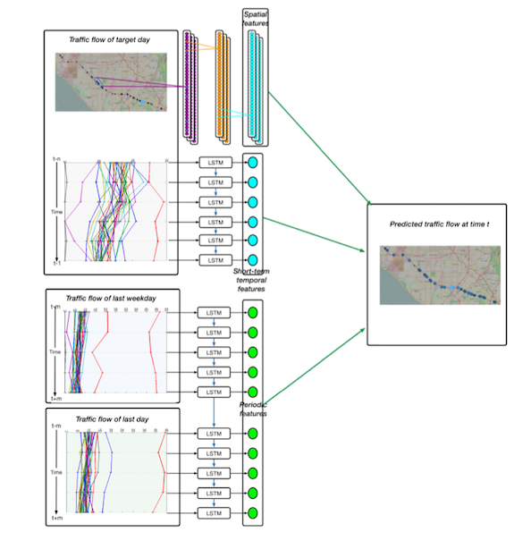

#  论文笔记: Short-term traffic flow forecasting with spatial-temporal correlation in a hybrid deep learning framework

> Short-term traffic flow forecasting with spatial-temporal correlation in a hybrid deep learning framework
>
> ​        by Wu Yuankai & Tan Huachun

## 1 任务描述

 对一条道路上的连续的33个交通点，每5分钟采集一个数字（如流量，车速等），共有一年多数据。这是一个时间序列预测问题，设定预测窗口为n，即假设需要预测t时刻的数字，即将`t`时刻之前的`n`个时刻的数据作为预测依据，可以表示为一个矩阵。该矩阵的列数等于窗口的大小`n`。因此每一个样本的样子如下，其中S代表预测依据，T为预测目标：
$$
S = 
\left[
\begin{matrix}
S_1 \\
S_2 \\
\cdots \\
S_{33}
\end{matrix}
\right]
= 
\left[ 
\begin{matrix}
s_1(t-n), s_1(t-(n-1),\cdots, s_1(t-1))\\
s_2(t-n), s_2(t-(n-1),\cdots, s_1(t-1))\\
\cdots \\
s_33(t-n), s_33(t-(n-1),\cdots, s_33(t-1))\\
\end{matrix}
\right]\tag{1}
\\
T =
\left[
\begin{matrix}
s_1(t) \\
s_2(t) \\
\cdots \\
s_{33}(t)
\end{matrix}
\right]
$$
确定n之后，依次滑动时刻`t`，就可以获得大量的sample， 用于学习和测试。

## 2 模型

论文采用的模型如下图所示：



分别描述如下：

1. 采用一维CNN捕捉空间关系。总共用了三层模型，其卷积核的长度分别为3，3，2. 卷积核的数据都是30，也就是输出的形状分别为(论文没有给出padding的类型，猜测采用“same”)：

   ```
   (33,30) 
   (33,30) 
   (33,30)
   ```

   所以最终的输出为：
   $$
   F^c =
   \left[
   \begin{matrix}
   f_1^1, f_1^2, \cdots, f_1^{30} \\
   f_2^1, f_2^2, \cdots, f_2^{30} \\
   \cdots \\
   f_{33}^1,f_{33}^2,\cdots, f_{33}^{30}
   \end{matrix}
   \right] \tag{1}
   $$

   > 这里用`c`表示空间特征。

2. 采用LSTM捕捉短时时间特征，即相邻的两个时间点之间的关系。实验中窗口参数为15，即t时刻的前15个时刻的值，被作为LSTM的输入，LSTM模型循环迭代15次，获得15 个输出向量。所以输入如下：
   $$
   T_1 =[s_1(t-n), s_2(t-n), \cdots, s_{33}(t-n)]\\
   T_2 =[s_1(t-n+1), s_2(t-n+1), \cdots, s_{33}(t-n+1)]\\
   \cdots \\
   T_{15} = [s_1(t-1), s_2(t-1), \cdots, s_{33}(t-1)]
   \tag{2}
   $$
   

   输出为15个向量，表示为：
   $$
   F^s = 
   \left[\begin{matrix}
   h_0^{\rightarrow}\\h_1^{\rightarrow}\\\cdots \\ h_{15}^{\rightarrow}
   \end{matrix}
   \right]
   \tag{3}
   $$

3. 采用LSTM模型捕捉周期性特征。这里有以天为单位的短周期与以一个星期为单位的长周期。首先设置了一个超级参数$n^d$和$n^w$都为6（文中所说的30分钟，除以采样间隔5）。对于短周期，假设当前预测的时刻为t，则取前一天同一时刻的前后各6个时刻的值，共12个时刻的值，构成LSTM的输入。对于长周期，则取上一个星期的同一天同一时刻的前后各6个时刻的值，构成LSTM的输入。注意这里长短周期采用一个模型。所以该模型的输入为总共24个时刻，迭代24次，获得24个输出：
   $$
   F^p =
   \left[
   \begin{matrix}
   h_{d1}^{\rightarrow}\\
   h_{d2}^{\rightarrow}\\
   \cdots  \\
   h_{d15}^{\rightarrow}\\
   h_{w1}^{\rightarrow}\\
   h_{w2}^{\rightarrow} \\
   \cdots \\
   h_{w15}^{\rightarrow}
   \end{matrix}
   \right]
   \tag{4}
   $$
   

4. 将前面的三个输出，进行组合，用一个券连接层。输入是对t时刻33个点的预测，所以模型输出有33个神经元。见前面的$T$

5.  总之，文章的模型是端到端的模型。在预测中，将时间依赖和空间依赖同时考虑进来，并且引入了周期信息。